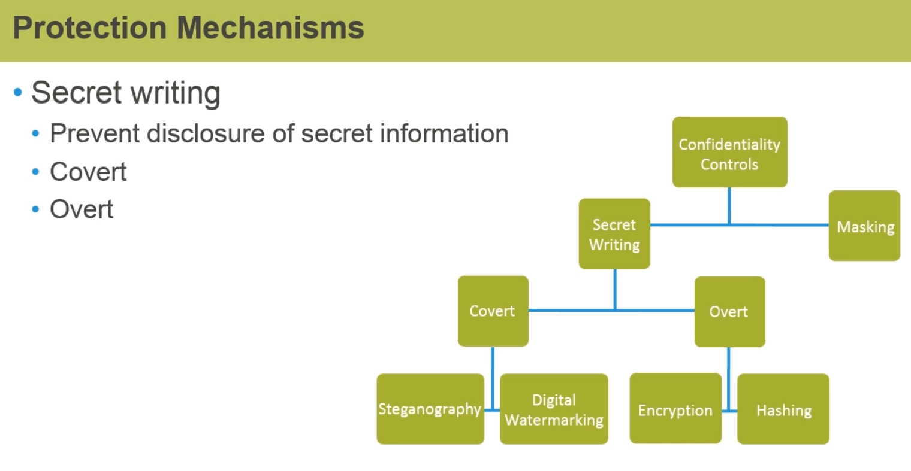

# Security guidelines

* [OWASP Cheat Sheet Series](https://cheatsheetseries.owasp.org/index.html)
* [Top 10 Web Application Security Risks](https://owasp.org/www-project-top-ten/)
* [Source Code Analysis Tools](https://owasp.org/www-community/Source_Code_Analysis_Tools)

## Security core concepts

### Confidentiality

Data classification: Public, Non-public

### Integrity

Validation to ensure integrity:
* Parity Bit
* Cyclic Redundancy Checking (CRC) = checksum
* Hashing
* Digital fingerprint

### Availability

Recovery Time Objective (RTO)

### Authentication and Authorization

Authentication types:
* Anonymous (public access)
* Basic
* Digest
* Integrated (Windows) - challenge/response
* Client certificates
* Forms
* Token-Based Authentication - used in conjunction with username and passwords
* Smart Cards
* Biometrics

Authorization:
* Discretionary Access Control (DAC)
    * Restrict access to objects
    * Identity based access control
    * Role based access control
    * Access control lists (ACL)
* Nondiscretionary AC (NDAC)
* Mandatory Access Control (MAC)
* Role Based Access Control (RBAC)

Accounting (Audit logs)

## Security design principles

* Least Privileges
* Separation of Duties
* Defense in Depth (layering security controls)
* Fail-safe
* Economy of Mechanism
* Complete Mediation
* Open Design
* Least Common Mechanisms
* Psychological Acceptability
* Weakest Link

## OWASP Top 10

### A5 Security Misconfiguration

Stick with defaults.
Patches

## SAST, DAST analysis tools

* Veracode
* AppScan on Cloud
* Web Header Scans
* Qualys
* WhiteSource
* QPExpress dashboards

## Links

* [Password Storage Cheat Sheet](https://www.owasp.org/index.php/Password_Storage_Cheat_Sheet)
* [How To Safely Store A Password](https://codahale.com/how-to-safely-store-a-password/)