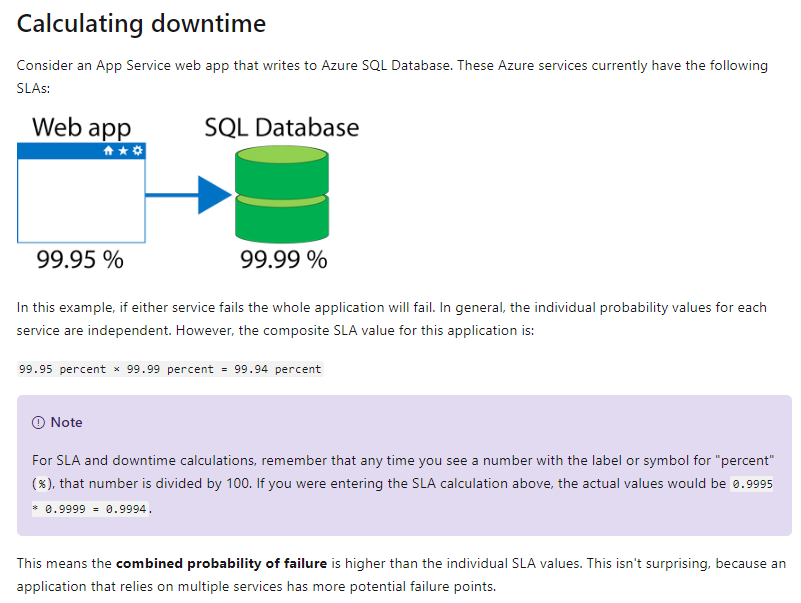

## What is a region?

A region is a geographical area on the planet containing at least one, but potentially multiple datacenters that are nearby and networked together with a low-latency network. Azure intelligently assigns and controls the resources within each region to ensure workloads are appropriately balanced.

A few examples of regions are _West US, Canada Central, West Europe, Australia East, and Japan West_.

## Special Azure regions

Azure has specialized regions that you might want to use when building out your applications for compliance or legal purposes. These include:

* US DoD Central, US Gov Virginia, US Gov Iowa and more: These are physical and logical network-isolated instances of Azure for US government agencies and partners. These datacenters are operated by screened US persons and include additional compliance certifications.

* China East, China North and more: These regions are available through a unique partnership between Microsoft and 21Vianet, whereby Microsoft does not directly maintain the datacenters.

Regions are what you use to identify the location for your resources, but there are two other terms you should also be aware of: _geographies and availability zones_.

## Geographies

Azure divides the world into geographies that are defined by geopolitical boundaries or country borders.

Geographies are broken up into the following areas:

* Americas
* Europe
* Asia Pacific
* Middle East and Africa

## Availability Zone

Availability Zones are physically separate datacenters within an Azure region.

Each Availability Zone is made up of one or more datacenters equipped with independent power, cooling, and networking. It is set up to be an isolation boundary. If one zone goes down, the other continues working. Availability Zones are connected through high-speed, private fiber-optic networks.

Not every region has support for Availability Zones.

Availability Zones are primarily for VMs, managed disks, load balancers, and SQL databases. Azure services that support Availability Zones fall into two categories:

* Zonal services – you pin the resource to a specific zone (for example, virtual machines, managed disks, IP addresses)
* Zone-redundant services – platform replicates automatically across zones (for example, zone-redundant storage, SQL Database).

## Region pairs

Each Azure region is always paired with another region within the same geography (such as US, Europe, or Asia) at least 300 miles away. This approach allows for the replication of resources (such as virtual machine storage) across a geography that helps reduce the likelihood of interruptions due to events such as natural disasters, civil unrest, power outages, or physical network outages affecting both regions at once. If a region in a pair was affected by a natural disaster, for instance, services would automatically fail over to the other region in its region pair.

## Service-Level Agreements for Azure

* SLAs describe Microsoft's commitment to providing Azure customers with specific performance standards.
* There are SLAs for individual Azure products and services.
* SLAs also specify what happens if a service or product fails to perform to a governing SLA's specification.

There are three key characteristics of SLAs for Azure products and services:

* Performance Targets
* Uptime and Connectivity Guarantees
* Service credits

When combining SLAs across different service offerings, the resultant SLA is called a _Composite SLA_.

## Application SLAs

You can use SLAs to evaluate how your Azure solutions meet business requirements and the needs of your clients and users. By creating your own SLAs, you can set performance targets to suit your specific Azure application. This approach is known as an _Application SLA_.

Resiliency

**Resiliency** is the ability of a system to recover from failures and continue to function. It's not about avoiding failures, but responding to failures in a way that avoids downtime or data loss. The goal of resiliency is to return the application to a fully functioning state following a failure. High availability and disaster recovery are two crucial components of resiliency.

**Considerations for defining application SLAs**

* If your application SLA defines four 9's (99.99%) performance targets, recovering from failures by manual intervention may not be enough to fulfill your SLA. Your Azure solution must be self-diagnosing and self-healing instead.
* It is difficult to respond to failures quickly enough to meet SLA performance targets above four 9's.
* Carefully consider the time window against which your application SLA performance targets are measured. The smaller the time window, the tighter the tolerances. If you define your application SLA as hourly or daily uptime, you need to understand these tighter tolerances might not allow for achievable performance targets.