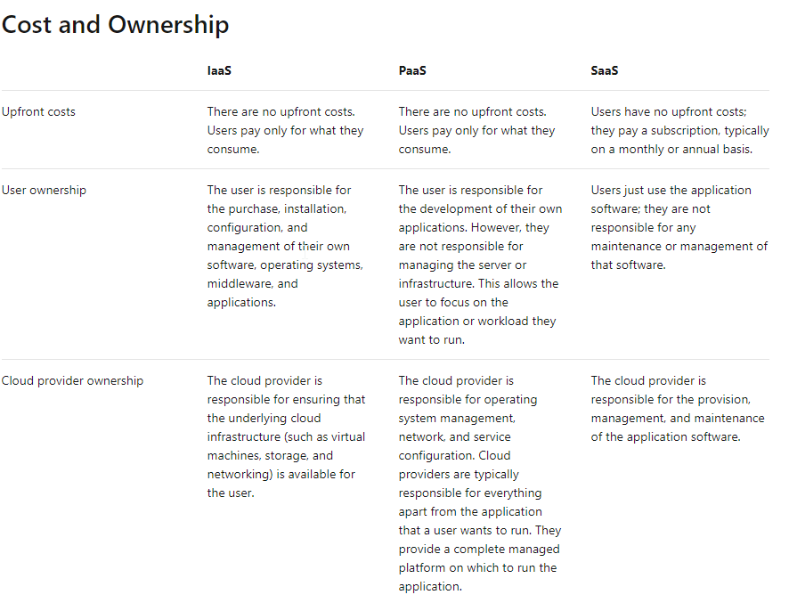
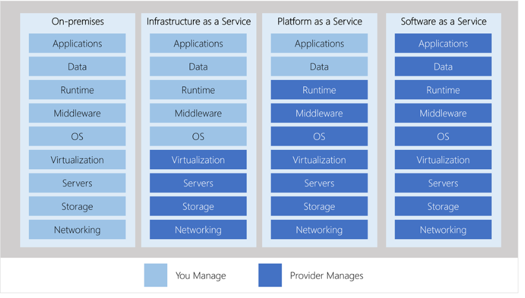

# Key concepts and terms

Cloud computing provides a **pay-as-you-g** or **consumption-based** pricing model.

Cloud services have certain characteristics and considerations, such as:

* Cost effective
* High availability
* Scalability: vertical (scaling up) and horizontal (scaling out)
* Elasticity
* Agility
* Fault tolerance
* Disaster recovery
* Global reach
* Customer latency capabilities
* Predictive cost considerations
* Security

_Economies of scale_ is the ability to do things more efficiently or at a lower-cost per unit when operating at a larger scale. This cost advantage is an important benefit in cloud computing.

## Capital expenditure (CapEx) versus operational expenditure (OpEx)

These two approaches to investment are referred to as:

* **Capital Expenditure (CapEx)**: CapEx is the spending of money on physical infrastructure up front, and then deducting that expense from your tax bill over time. CapEx is an upfront cost, which has a value that reduces over time.
* **Operational Expenditure (OpEx)**: OpEx is spending money on services or products now and being billed for them now. You can deduct this expense from your tax bill in the same year. There's no upfront cost. You pay for a service or product as you use it.

## Cloud deployment models

* Public
* Private (Azure Stack)
* Hybrid

Public:
* Service consumption through on-demand or subscription model
* No up-front investment of hardware
* Automation
* Geographic dispersity
* Reduced hardware maintenance

Private:
* Pre-existing environment
* Legacy applications
* Data sovereignty and security
* Regulatory compliance / certification

Hybrid:
* Existing hardware investment
* Regulatory requirements
* Unique operating environment
* Migration

## Types of cloud services

**Infrastructure as a service (IaaS)**

IaaS is commonly used in the following scenarios:

* Migrating workloads
* Test and development
* Storage, backup, and recovery
* Website hosting
* Web apps
* High-performance computing
* Big data analysis

**Platform as a service (PaaS)**

PaaS is commonly used in the following scenarios:
* Development framework
* Analytics or business intelligence

**Software as a service (SaaS)**

Management responsibilities

## Consumption-based model

## Basic services

* Compute power
    * VMs
    * Containers
    * Serverless computing

* Storage