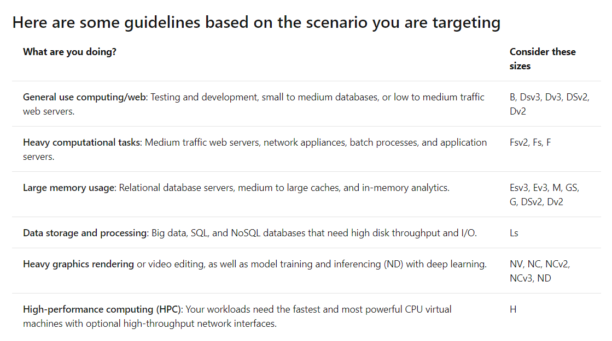

## VMs

Options available to create and manage an Azure Virtual Machine:

* Azure Resource Manager
* Azure PowerShell
* Azure CLI
* Azure REST API
* Azure Client SDK
* Azure VM Extensions
* Azure Automation Services

### Availability

To ensure your services aren't interrupted and avoid a single point of failure, it's recommended to deploy at least two instances of each VM. This feature is called an availability set.

An **availability set** is a logical feature used to ensure that a group of related VMs are deployed so that they aren't all subject to a single point of failure and not all upgraded at the same time during a host operating system upgrade in the datacenter. VMs placed in an availability set should perform an identical set of functionalities and have the same software installed.

**Fault domain**

A fault domain is a logical group of hardware in Azure that shares a common set of hardware components, and that share a single point of failure.. You can think of it as a rack within an on-premises datacenter. The first two VMs in an availability set will be provisioned into two different racks so that if the network or the power failed in a rack, only one VM would be affected. Fault domains are also defined for managed disks attached to VMs.

**Update domain**

An update domain is a logical group of hardware that can undergo maintenance or be rebooted at the same time. Azure will automatically place availability sets into update domains to minimize the impact when the Azure platform introduces host operating system changes. Azure then processes each update domain one at a time.

**Failover across locations**

**Azure Site Recovery** replicates workloads from a primary site to a secondary location. If an outage happens at your primary site, you can fail over to a secondary location. This failover allows users to continue to access your applications without interruption.

### Sizing your VM



## Azure CLI commands

```bash
# create vm
az vm create \
  --resource-group learn-b461975d-e925-4f29-8288-a54fa6cc59ed \
  --name MeanStack \
  --image Canonical:UbuntuServer:16.04-LTS:latest \
  --admin-username azureuser \
  --generate-ssh-keys

# open port
az vm open-port \
  --port 80 \
  --resource-group learn-b461975d-e925-4f29-8288-a54fa6cc59ed \
  --name MeanStack

# save public address to env var
ipaddress=$(az vm show \
  --name MeanStack \
  --resource-group learn-b461975d-e925-4f29-8288-a54fa6cc59ed \
  --show-details \
  --query [publicIps] \
  --output tsv)

# connect
ssh azureuser@$ipaddress
```