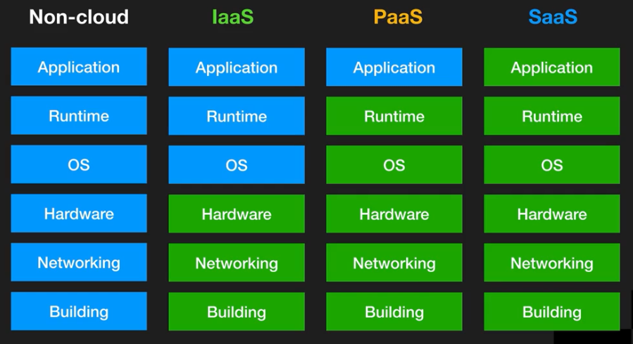
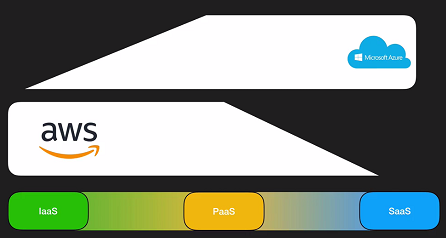
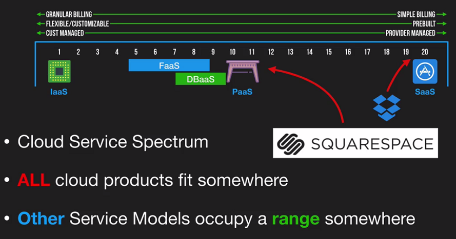

# Cloud

https://landscape.cncf.io/

## Characteristics

The NIST Definition of Cloud Computing (publication 800-145) is defined what is Cloud.

5 Essential Characteristics of the Cloud:

1. On-demand self-service
    * "a consumer can unilaterally provision computing capabilities... ...as needed automatically **without requiring human interaction** with each service provider.
1. Broad network access
1. Resource pooling
    * "...resources are pooled to serve multiple consumers using **a multi-tenant model**..."
    * "There is a sense of **location indepedence** in that the customer generally has no control or knowledge over the exact location of the provided resources..."
1. Rapid elasticity
    * "Capabilities can be elastically provisioned and released...to **scale rapidly** outward and inward commensurate with demand"
    * "To the consumer, the capabilities available for provisioning often **appear to be unlimited**..."
1. Measured service
   * "Resource usage can be **monitored, controled, and reported** providing transparency for both the provider and consumer of the utilized service."

## Deployment Models

* Public
  * Azure, AWS, Google Cloud
  * Is easy
* Private
  * Be *very* skeptical
* Hybryd
  * Public + Public
  * Public + Private
  * Be skeptical
* Community
  * It exists

## Service Models

Service model defines what end-users gets, manages, sees.

**Unit of consumption (UoC)** term is defined what you as a customer consume from service provider.
Billing (cost) for service is based on UoC.

Three service models:

* **IaaS** - Infrastructure as a Service
  * UoC: VM or OS
  * Billing: Per second/minute/hour when VM is active
* **PaaS** - Platform as a Service
  * UoC: Runtime Environment (Node.js, PHP, etc.)
* **SaaS** - Software as a Service

IaaS -> PaaS -> SaaS:

* You loose flexibility
* You gain in terms of easy of management: less costs, less risks

AWS and Azure service models priorities and path.

* Azure more SaaS and PaaS
* AWS more IaaS and PaaS

Additional notable service models:

* **FaaS** - Function as a Service - when you upload a single function (**serverless architecture**). Examples: Azure Functions, AWS Lambda
* **DBaaS** - Database as a Service. Examples: Azure Cosmos DB, AWS DynamoDB, Google Spanner. They have fairly deep into performance tuning and configuration.

