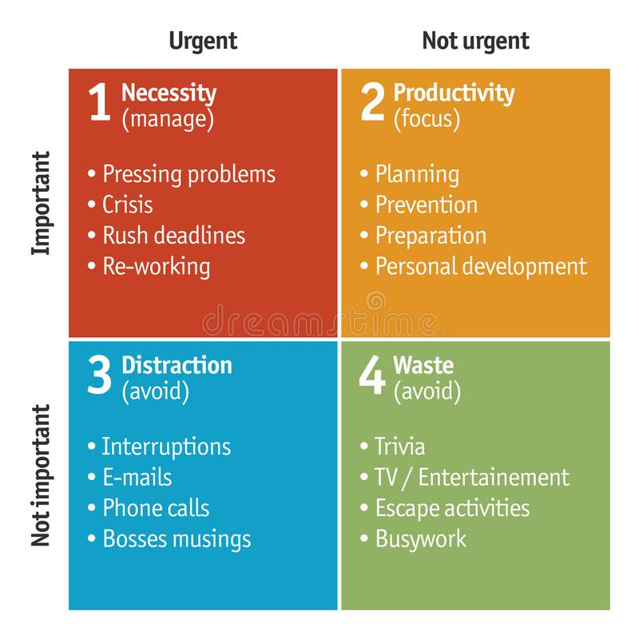
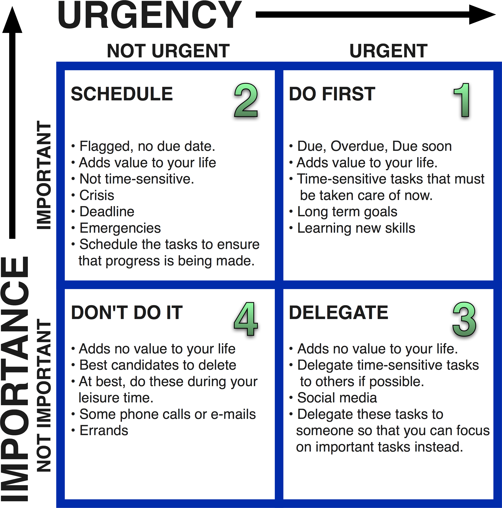

# Time management

Areas for balancing:
- Job
- Life
- Personal development

## Day planning

There will never be enough time to get everything done.
But there will always be enough time to get the most important things done.

The process is:
* List all tasks for the day
* Estimate task time and sequence by Priority/Importance
* Delegate some tasks

Priorities
* Pareto rule - 80% of tasks / 20% efforts
* Eisenhower matrix
* Common sense
* Don't mix up priorities and enthusiasm!

Effectiveness
* Achiving result
* Using the shortest way
* During the minimal possible time

### Eisenhower matrix

Decide: Do you have to do it yourself? If not - delegate!

If the price of your time is higher than the price of service - buy the service and "free your time".

Divide "what to do" and "when to do":
* Stiff tasks - connected to definite time
* Flexible tasks - can be done at any time
* Budgeted tasks - big tasks which need a long period of time to do

1. Time box
1. Put tasks on a special list -> make your head free

## Week/Month planning

* Set goals for every week (SMART goal)
  * 30-60 min to plan the week
* Plan your month
* Schedule time of absence

## SMART approach

* Specific
* Measurable
* Attainable
* Relevant
* Time-bound

## Instruments

* Calendar
* Outlook and OneNote
* ToDo lists:
  * Evernote
  * Wunderlist
  * Google keep
  * Trello

[Google Keep VS Wunderlist](https://www.guidingtech.com/google-keep-vs-wunderlist-comparison/),
[Google Keep VS Wunderlist VS Trello](https://www.slant.co/topics/1262/versus/~google-keep_vs_wunderlist_vs_trello)

## Pomodoro

Pomodoro
- 25 minutes of work
- Switch off from the outside world
- Work strictly on one task
- Mark when the task is completed

Break
- 5 minutes
- Go back to the outside world
- Every 4 pomodoros - 30 minutes break

Create the right environment and atmosphere!

ASMR room

Protect your time! Say, no!
Set the expectations.

## Time killers

* Messengers
* Social networks
* Coffe talks
