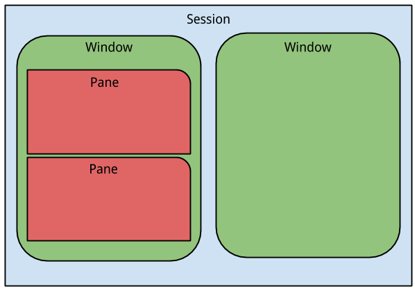

# Tmux

## Install

```bash
sudo apt-get install tmux
tmux
```



[Basic hot keys](https://github.com/var-bin/terminalForCoder__WSD/blob/master/tmux/hotkey.md)

Config file `.tmux.conf` (must be placed in user home directory)

## Windows

* Ctrl + b, c - create new window
* Ctrl + b, , - rename window
* Ctrl + b, int - switch between windows (int - window number 0,1,2..)

## Panes

* Ctrl + b and Shift + 5 - split current region into two vertical panesx
* Ctrl + b and Shift + " - split horizontally
* Ctrl + b, ← ↑ → ↓ - moving between panes
* Ctrl + b and o - toggle between panes
* Ctrl + b and x - close current pane
* Ctrl + b, w - interactive pane selection

Connect to closed session: `tmux attach`

[Official site](https://github.com/tmux/tmux/wiki) | [Great cheatsheet](https://gist.github.com/MohamedAlaa/2961058)
